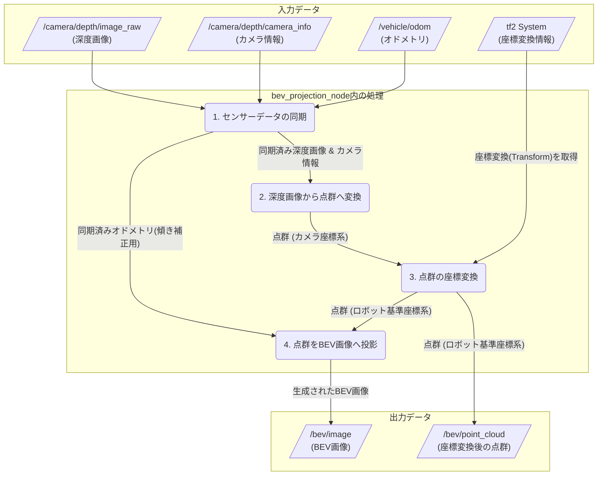

```mermaid
graph TD
    subgraph Inputs [入力データ]
        A[/"/camera/depth/image_raw<br>(深度画像)"/]
        B[/"/camera/depth/camera_info<br>(カメラ情報)"/]
        C[/"/vehicle/odom<br>(オドメトリ)"/]
        D[/"tf2 System<br>(座標変換情報)"/]
    end

    subgraph Process [bev_projection_node内の処理]
        P1(1. センサーデータの同期)
        P2(2. 深度画像から点群へ変換)
        P3(3. 点群の座標変換)
        P4(4. 点群をBEV画像へ投影)
    end

    subgraph Outputs [出力データ]
        O1[/"/bev/point_cloud<br>(座標変換後の点群)"/]
        O2[/"/bev/image<br>(BEV画像)"/]
    end

    %% データフローの定義
    A --> P1
    B --> P1
    C --> P1

    P1 -- 同期済み深度画像 & カメラ情報 --> P2
    P2 -- 点群 (カメラ座標系) --> P3
    D -- 座標変換(Transform)を取得 --> P3
    
    P3 -- 点群 (ロボット基準座標系) --> O1
    P3 -- 点群 (ロボット基準座標系) --> P4
    P1 -- 同期済みオドメトリ(傾き補正用) --> P4

    P4 -- 生成されたBEV画像 --> O2
```
